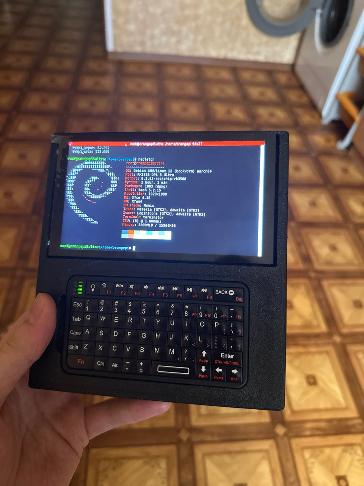
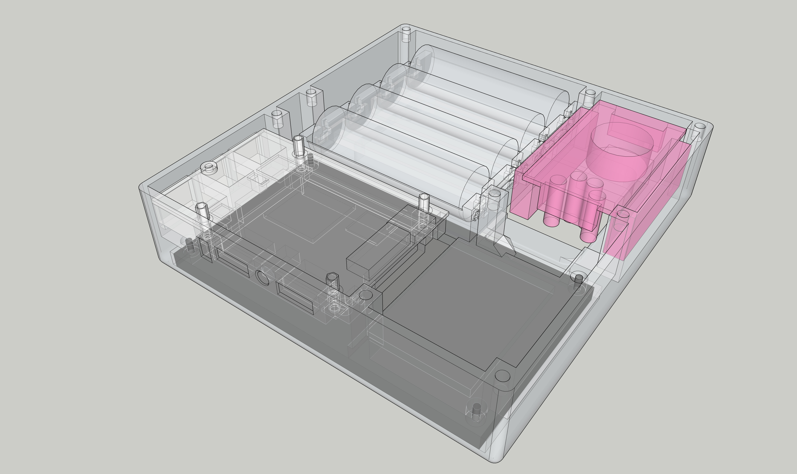
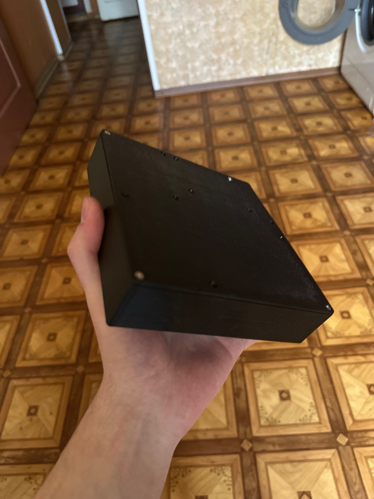
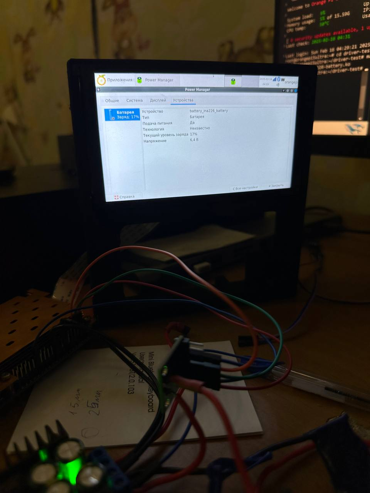

# CyberDeck on Orange Pi 5 Ultra



A handheld cyberdeck built around the Orange Pi 5 Ultra (RK3588): a 5.5" DSI touchscreen,
a 3D-printed enclosure, an internal 2S Li-Ion pack with INA226 battery monitoring exposed to
the OS as a real battery device, and local LLM inference on the board's NPU.

> **Status:** work in progress. The 3D models are at an early stage and still need dimensional
> adjustments before printing.

## Contents

- [Part list](#part-list)
- [3D printing](#3d-printing)
- [Soldering of parts](#soldering-of-parts)
- [Install OS](#install-os)
- [LLM local launch](#llm-local-launch)
- [Gallery](#gallery)
- [License](#license)

## Part list

| # | Part | Qty | Notes |
|---|------|-----|-------|
| 1 | Orange Pi 5 Ultra | 1 | RK3588, main board |
| 2 | SURENOO SUR10801920D055A 5.5" DSI display | 1 | 1080×1920, touchscreen |
| 3 | Li-Ion 21700 cell, LiitoKala 5000 mAh | 2 | wired as 2S |
| 4 | XL4016 DC/DC step-down converter | 1 | 2S pack → 5 V rail |
| 5 | Rii 518BT mini keyboard | 1 | Bluetooth |
| 6 | INA226 voltage/current sensor module | 1 | battery monitoring |
| 7 | Official Orange Pi 5.1 V 5 A power supply | 1 | bench power / charging source |
| 8 | Brass fused studs M2.5 | assorted | various lengths |
| 9 | Copper heatsink | 1 | for the SoC |
| 10 | TZT 2S 20 A BMS with balancing | 1 | pack protection |
| 11 | 2S Li-Ion charge module, 8.4 V | 1 | |
| 12 | SMD shunt resistor 0.01 Ω | 1 | for the INA226 |
| 13 | 35 mm cooling fan | 1 | |

`TODO: add url links`

## 3D Print Model



All 3D models are at an early stage of development, still need to be adjusted in size!

The model for printing consists of 3 parts: the main body, the battery pack and the back cover.

Source model: [`models/drholy Console.skp`](models/drholy%20Console.skp) (SketchUp).

`TODO: Redesign the enclosure in FreeCAD.`

## Soldering of parts

The connection diagram is presented in a separate
[repository](https://github.com/DrHo1y/ina226-battery-driver).

## Install OS

Use my [Debian 12 6.1.x XFCE build](https://github.com/DrHo1y/orangepi-build/releases/tag/v1.0.0).
It ships the latest NPU driver and adds support for the SURENOO SUR10801920D055A 5.5" DSI display
and the INA226 battery driver.

To write the system to storage, use the standard instructions from the manufacturer.

To enable the display, add the `Orangepi-5-Plus-LCD` overlay.

To flip the image:

```bash
sudo set_lcd_rotate.sh left
```

To calibrate the touch screen, replace the file:

`TODO: Find the exact location of the file`

## LLM local launch

To run an LLM locally on the NPU, I prepared tools for myself and posted them in a separate
[repository](https://github.com/DrHo1y/rkllm-gradio-server).

## Gallery

| Printed enclosure | INA226 battery reported to the OS |
|---|---|
|  |  |

## License

Released under [CC BY-NC 4.0](LICENSE.md) — attribution required, non-commercial use only.
